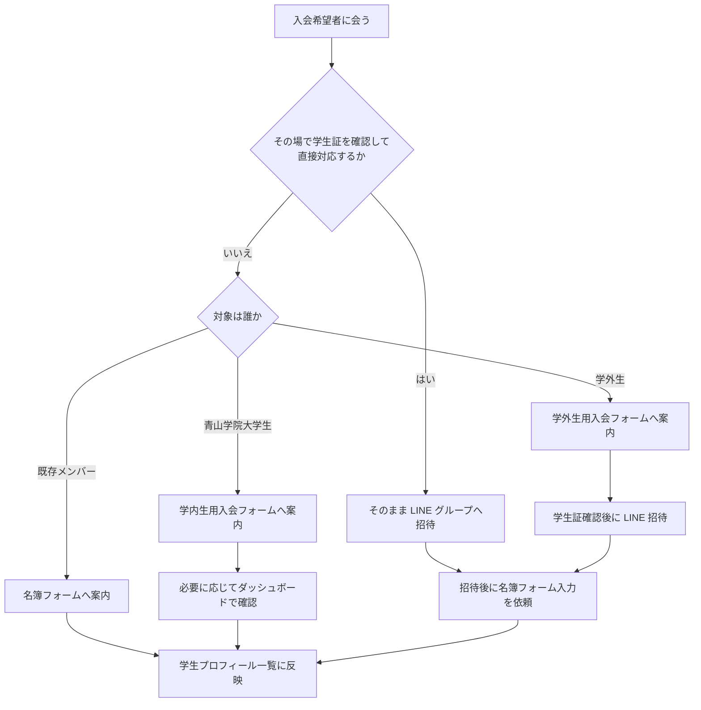

# APS サイト運用マニュアル

対象:
APS の管理者・運営メンバー

このマニュアルは、APS の新規入会案内、既存メンバーの名簿登録案内、管理画面での確認作業を、管理者向けに整理した運用文書です。

## 0. 最初に確認する運用ルール

通常はサイト上のフォームに沿って案内しますが、対面イベントやオフライン対応では、必ずしもサイトの標準フローどおりに進まないことがあります。

そのため、最初に次のルールを共有します。

### 0-1. オフラインでその場対応してよいケース

従来どおり、学生証をその場で確認できる場合は、フォーム入力を待たずにそのまま LINE グループへ招待していただいて問題ありません。

ただし、その場合でも、あとから名簿登録にご協力いただく流れをお願いしています。

管理者の皆さまには、招待後に新メンバーへ次のご案内をお願いしています。

- LINE グループ招待後に、名簿フォームからの名簿登録にご協力をお願いします

この名簿フォームは、サイト上では既存加入者向けの本入会フォームとして案内されています。

### 0-2. 原則

運用の基本は次の 3 本立てです。

1. 青山学院大学生は学内生用の入会フォームから入会する
2. 学外生は学外生用のフォームから入会する
3. すでに入会している人は名簿フォームから情報を入力する

## 1. 全体フロー

## 2. どのフォームを案内するか

### 2-1. 青山学院大学生

案内先:
- 学内生用の入会フォーム
- 実装上のページ: `/join/form/aoyama-student`

使う場面:
- 青山学院大学の在学生が新しく APS に入会したいとき

運用ポイント:
- 学籍番号をもとに大学メールアドレスが補完されます
- 基本情報はこのフォームから受け付けます
- その後の確認状況は管理画面で確認できます

管理者の案内例:
- 青学生の方は、学内生用の入会フォームから入力してください

### 2-2. 学外生

案内先:
- 学外生用の入会フォーム
- 実装上のページ: `/join/form/other`

使う場面:
- 他大学の学生が新しく APS に入りたいとき

運用ポイント:
- 学外生フォームは送信後に自動で入会完了になるわけではありません
- 学生証の確認が別途必要です
- 学生証確認後に LINE グループへ招待します

管理者の案内例:
- 学外生の方は、まず学外生用フォームを送信してください
- 送信後に学生証を確認して、確認できたら LINE グループへ招待します

### 2-3. すでに入会している人

案内先:
- 名簿フォーム
- サイト上の名称: 本入会フォーム
- 実装上のページ: `/join/member`

使う場面:
- すでに APS に加入済みだが、名簿情報をまだ入れていない人
- 対面で先に LINE に招待したあと、あとから名簿登録してもらうとき
- 既存メンバーの情報を更新したいとき

運用ポイント:
- このフォームは新規入会者向けではなく、加入済みの人向けです
- 登録後の内容は学生プロフィール一覧に反映されます
- 同じメールアドレスで再登録した場合は、最新の内容で上書きされる前提で運用してください

管理者の案内例:
- すでに加入済みなので、名簿フォームから情報登録をお願いします
- 直接 LINE に招待した方も、あとで必ず名簿フォームを入力してください

## 3. 標準運用フロー

### 3-1. 青山学院大学生の標準フロー

1. 学内生用の入会フォームを案内する
2. 入力内容を受け付ける
3. 必要に応じて管理画面で内容を確認する
4. 運用上問題がなければ入会処理を進める
5. 学生プロフィール一覧に反映されたことを確認する

### 3-2. 学外生の標準フロー

1. 学外生用のフォームを案内する
2. 送信後、対面などで学生証を確認する
3. 問題なければ LINE グループへ招待する
4. 必要に応じて名簿登録も依頼する

補足:
- 学外生は、フォーム送信だけでは完了扱いにしないでください
- 学生証確認が運用上の重要ポイントです

### 3-3. 既存メンバーの標準フロー

1. 名簿フォームを案内する
2. 情報を入力してもらう
3. 学生プロフィール一覧に反映されたことを必要に応じて確認する

## 4. 例外運用フロー

### 4-1. その場で直接 LINE 招待する場合

イベントや新歓などで、学生証をその場で確認できる場合は、フォーム入力前にそのまま LINE グループへ招待してかまいません。

ただし、次の順番で運用してください。

1. 学生証を確認する
2. その場で LINE グループへ招待する
3. 招待後に、名簿フォームの入力を依頼する
4. 必要なら後日、管理画面で登録状況を確認する

このフローで重要なこと:
- LINE 招待だけで終わりにしないこと
- 名簿登録の依頼を必ずセットで行うこと
- 後日確認が必要な場合は、管理画面で追うこと

管理者がその場で伝える文言例:
- 先に LINE グループへ招待します。あとで名簿フォームの入力をお願いします
- 名簿登録がまだなので、加入後に本入会フォームから情報を入れてください

## 5. 管理画面で管理者が行うこと

対象画面:
- ダッシュボード

関連ドキュメント:
- `DASHBOARD_USAGE_GUIDE.md`

管理画面では主に次を確認します。

1. 入会リクエスト一覧
2. 学生プロフィール一覧
3. お問い合わせ一覧

### 5-1. 入会リクエスト一覧

見る目的:
- 新規申請の有無を確認する
- 申請内容に不備がないかを見る
- 認証済みに進めるか判断する

### 5-2. 学生プロフィール一覧

見る目的:
- 名簿登録が完了しているかを確認する
- 既存メンバーの情報を確認する
- 必要に応じて編集する

特に確認したいケース:
- オフラインで先に LINE 招待した人が、後から名簿フォームを入れたか
- 既存メンバーの情報が不足していないか

### 5-3. お問い合わせ一覧

見る目的:
- サイトからの連絡を確認する
- 必要に応じて対応する

## 6. 管理者向けの判断基準

### 6-1. 青学生かどうかで迷ったとき

- 青山学院大学の在学生であれば、まず学内生用フォームを案内します
- それ以外は学外生用フォームを案内します

### 6-2. すでに加入済みかどうかで迷ったとき

- すでに LINE グループに参加済み
- すでに APS の加入者として扱っている

このどちらかに当てはまる場合は、名簿フォームを案内する運用で問題ありません。

### 6-3. 忙しい現場でフォーム案内までできないとき

- 学生証確認ができるなら、先に LINE 招待してよい
- ただし、その後の名簿フォーム入力依頼を忘れない

## 7. 管理者チェックリスト

### 7-1. 新規対応時

- 青学生か学外生かを確認した
- 標準フローで案内するか、オフライン例外で対応するかを決めた
- 必要なら学生証を確認した
- LINE 招待後に名簿フォーム入力を依頼した

### 7-2. 後追い確認時

- ダッシュボードの入会リクエスト一覧を確認した
- 学生プロフィール一覧に登録が反映されているか確認した
- 直接招待した人の名簿登録漏れがないか確認した

## 8. 管理者向けの短い案内文テンプレート

### 8-1. 青学生への案内

- 青学生の方は、学内生用の入会フォームから入力してください

### 8-2. 学外生への案内

- 学外生の方は、学外生用フォームを送信してください。送信後に学生証を確認して、確認できたら LINE グループへ招待します

### 8-3. 既存メンバーへの案内

- すでに加入済みの方は、名簿フォームから情報を入力してください

### 8-4. オフラインで直接招待した人への案内

- 先に LINE グループへ招待します。加入後に名簿フォームから名簿登録をお願いします

## 9. このマニュアルの前提

このマニュアルは、現在のサイト実装と運用前提に基づいています。

前提としている運用:
- 青学生は学内生用フォーム
- 学外生は学外生用フォーム
- 加入済みの人は名簿フォーム
- オフラインでは学生証確認後に直接 LINE 招待も可
- ただし直接招待した場合も、あとで名簿フォーム入力を依頼する
