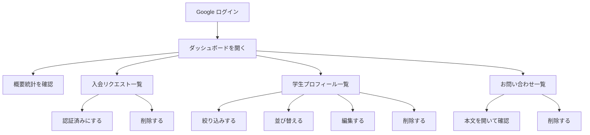
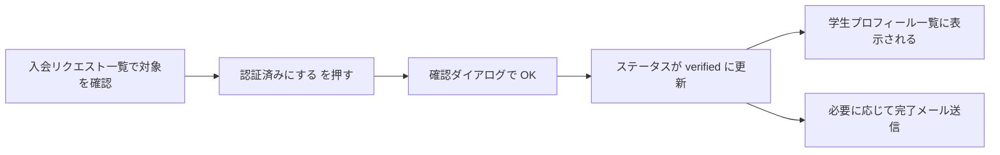
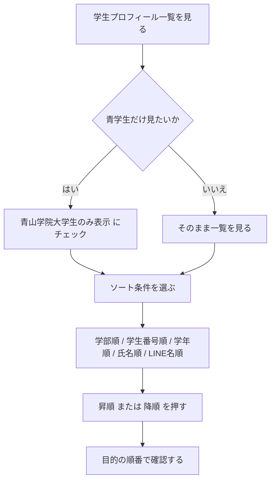
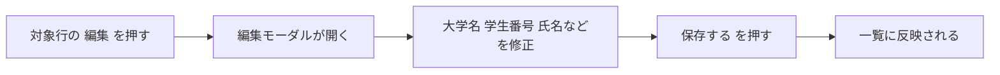
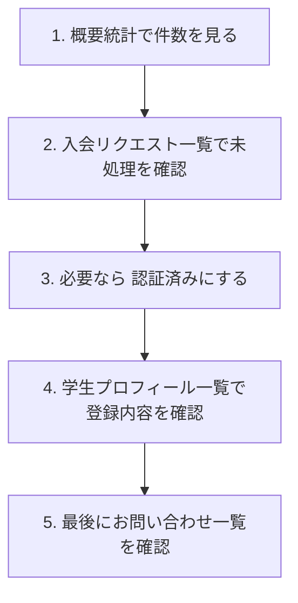

# APS ダッシュボード利用ガイド

対象画面:
https://aps-auth-system.vercel.app/dashboard

このドキュメントは、システム開発に関わっていないメンバーでも APS の管理画面を安全に使えるようにするための操作ガイドです。

## 0. まず全体像をつかむ

以下の図を見ると、ダッシュボードで何をどの順に見る画面なのかを一度に把握できます。



## 0-1. スクリーンショットについて

図だけでなく、実際の画面キャプチャも追加しています。文章だけでは分かりにくい場合は、先にこの節の画像を見てから下の説明を読むと理解しやすくなります。

### ダッシュボード全体


### 入会リクエスト一覧


### 学生プロフィール一覧

ソート欄と絞り込み欄もここに含まれています。


### プロフィール編集モーダル


### お問い合わせ一覧


### お問い合わせ全文モーダル


## 1. ダッシュボードでできること

ダッシュボードでは、主に次の 3 つを管理できます。

1. 入会リクエストの確認
2. 認証済みメンバーのプロフィール確認・編集
3. お問い合わせの確認

画面上部には件数のサマリーが表示され、その下に一覧テーブルが並びます。

## 2. 利用できる人

ダッシュボードは、Google ログイン済みで、かつ管理者として許可されたメールアドレスのユーザーだけが使えます。

利用の流れ:

1. ログイン画面から Google ログインする
2. 許可済みメールアドレスでログインしている場合のみダッシュボードへ入れる
3. 権限がない場合はログイン画面に戻される

## 3. 画面構成

ダッシュボードには次のブロックがあります。

### 3-0. 画面の見取り図

実際の画面は表形式ですが、構造はおおむね次のようになっています。

```text
+--------------------------------------------------------------+
| ダッシュボード                                                |
| ログイン中: 管理者メールアドレス                              |
+--------------------------------------------------------------+
| 概要統計                                                     |
| [入会リクエスト] [確認済み入会] [学生プロフィール] [お問い合わせ] |
+--------------------------------------------------------------+
| 入会リクエスト一覧                                            |
| 学生番号 | 氏名 | 学部 | 学年 | メール | ステータス | 操作     |
+--------------------------------------------------------------+
| 学生プロフィール一覧                                          |
| [青山学院大学生のみ表示] [ソート条件] [昇順] [降順]          |
| 大学名 | 学生番号 | 氏名 | 学部 | 学年 | LINE名 | 操作       |
+--------------------------------------------------------------+
| お問い合わせ一覧                                              |
| 氏名 | メール | 件名 | 所属 | メッセージ | 受信日 | 操作      |
+--------------------------------------------------------------+
```

### 3-1. ヘッダー

表示内容:

- 画面タイトル: ダッシュボード
- 現在ログイン中のメールアドレス

### 3-2. 概要統計

4 つの件数が表示されます。

- 入会リクエスト: 全入会リクエスト件数
- 確認済み入会: 認証完了した件数
- 学生プロフィール: 学生プロフィール総数
- お問い合わせ: 受信した問い合わせ件数

※ ここは確認用の表示で、直接操作はできません。

### 3-3. 入会リクエスト一覧

入会申請の内容を確認する一覧です。

主な表示項目:

- 学生番号
- 氏名
- フリガナ
- 学部
- 学科
- 学年
- LINE 名
- 電話番号
- メールアドレス
- ステータス
- 作成日

右端の操作:

- 認証済みにする
- 削除

### 3-4. 学生プロフィール一覧（認証成功者）

認証済みまたは登録済みの人のプロフィール一覧です。

主な表示項目:

- 大学名
- 学生番号
- 氏名
- フリガナ
- 学部
- 学科
- 学年
- LINE 名
- 電話番号
- メールアドレス
- ステータス
- 作成日時

右端の操作:

- 編集
- 削除

一覧上部の補助機能:

- 青山学院大学生のみ表示: 青山学院大学の学生だけに絞り込み
- ソート: 並び順の切り替え
- 表示件数: 現在表示中の件数 / 全件数

### 3-5. お問い合わせ一覧

問い合わせフォームから届いた内容を確認する一覧です。

主な表示項目:

- 氏名
- メール
- 件名
- 所属
- メッセージ
- 受信日

右端の操作:

- 削除

メッセージ欄は長文が省略表示されます。クリックすると全文がモーダルで表示されます。

## 4. ステータスの意味

ダッシュボードでは主に次のステータスを扱います。

- verified: 認証済み
- member: 加入者として登録済み
- それ以外: 未確認または確認待ち

運用上の理解:

- verified は、本入会の確認が完了した状態です
- member は、すでに加入済みメンバーとして登録されている状態です
- 学生プロフィール一覧には verified と member の両方が表示されます

## 5. 入会リクエスト一覧の使い方

### 5-1. 申請内容を確認する

一覧を見て、必要な情報が揃っているか確認してください。

確認しやすい項目:

- 氏名
- 学籍情報
- LINE 名
- メールアドレス
- ステータス

### 5-2. 認証済みにする

対象:

- 確認が完了した申請

手順:

1. 対象行の 認証済みにする を押す
2. 確認ダイアログで内容を確認する
3. OK を押す

結果:

- ステータスが verified に更新されます
- 画面上の表示も更新されます
- 対象者には本入会完了メールが送られる場合があります

流れを図で表すと、次のようになります。



重要な注意:

- すでに member の人を verified に変更する場合は、完了メールは送られません
- verified に変更すると運用上の完了扱いになるため、確認前に押さないでください

### 5-3. 削除する

手順:

1. 対象行の 削除 を押す
2. 確認ダイアログで対象者を確認する
3. 削除する を押す

結果:

- 入会リクエストが完全に削除されます
- この操作は取り消せません

運用上の注意:

- 誤削除防止のため、削除前に対象の氏名とメールアドレスを必ず確認してください
- 不要な重複申請の整理以外では、安易に削除しないことを推奨します

## 6. 学生プロフィール一覧の使い方

この一覧は、認証成功者のプロフィールを確認・整理するための一覧です。

### 6-1. 青山学院大学生のみ表示する

一覧上部の 青山学院大学生のみ表示 にチェックを入れると、大学名が 青山学院大学 の人だけが表示されます。

使いどころ:

- 青学生だけを見たいとき
- 学内向け名簿確認をしたいとき
- 学生番号ベースで確認したいとき

### 6-2. 並び替える

ソート機能で、次の順番に並び替えできます。

- 学部順
- 学生番号順
- 学年順
- 氏名順
- LINE名順

並び順は次の 2 種類です。

- 昇順
- 降順

操作方法:

1. ソートのプルダウンから項目を選ぶ
2. 昇順 または 降順 を押す

補足:

- 学年順は、1年・2年・3年・4年のような数字の順で並びます
- 表示件数 に、現在の絞り込み後の件数が表示されます

操作イメージ:



### 6-3. プロフィールを編集する

編集できる項目:

- 大学名
- 学生番号
- 氏名
- フリガナ
- 学部
- 学科
- 学年
- LINE名
- 電話番号

編集できない項目:

- メールアドレス

手順:

1. 対象行の 編集 を押す
2. 編集モーダルを開く
3. 必要な項目を修正する
4. 保存する を押す

結果:

- 該当プロフィールが保存されます
- 一覧表示にも反映されます

編集の流れ:



運用上の注意:

- 氏名、学籍情報、LINE 名の誤記修正に使ってください
- メールアドレスは変更できません
- 値が未登録の項目は空欄として編集されます

### 6-4. プロフィールを削除する

手順:

1. 対象行の 削除 を押す
2. 確認ダイアログで対象を確認する
3. 削除する を押す

結果:

- 元の join request データごと削除されます
- 一覧から即時に消えます
- この操作は取り消せません

注意:

- 編集ミスの修正は、まず削除ではなく編集で対応してください
- 削除は重複データや明らかな不要データの整理時に限定するのが安全です

## 7. お問い合わせ一覧の使い方

### 7-1. 問い合わせ本文を読む

手順:

1. メッセージ欄の省略表示テキストを押す
2. モーダルで全文を確認する
3. 閉じる を押して戻る

### 7-2. 問い合わせを削除する

手順:

1. 対象行の 削除 を押す
2. 確認ダイアログで内容を確認する
3. 削除する を押す

結果:

- 問い合わせデータが削除されます
- この操作は取り消せません

## 8. エラーや読み込み中の見え方

### 読み込み中

画面中央に 読み込み中... が表示されます。

### エラー発生時

画面上部に赤いエラーメッセージが表示されます。

想定される原因:

- 通信エラー
- 権限不足
- サーバー側の更新失敗

まず確認すること:

1. ログイン状態
2. 権限があるメールアドレスで入っているか
3. 時間をおいて再読み込みして改善するか

## 9. よくある運用パターン

### 画面ごとのおすすめ確認順

初めて使うメンバーは、次の順番で画面を見ると混乱しにくいです。



### パターン 1: 新規申請を確認して本入会完了にする

1. 入会リクエスト一覧を開く
2. 対象の申請内容を確認する
3. 問題なければ 認証済みにする を押す
4. 学生プロフィール一覧に反映されたことを確認する

### パターン 2: 学生情報の誤字を直す

1. 学生プロフィール一覧で氏名または学生番号を探す
2. 必要ならソートや絞り込みを使う
3. 編集 を押す
4. 内容を修正して保存する

### パターン 3: 青学生だけを確認する

1. 学生プロフィール一覧で 青山学院大学生のみ表示 にチェックを入れる
2. 必要に応じて 学部順 または 学生番号順 に並び替える

### パターン 4: 問い合わせ本文を確認する

1. お問い合わせ一覧を開く
2. メッセージ欄をクリックする
3. 内容確認後、必要なら削除する

## 10. 運用上の注意事項

- 削除はすべて取り消せません
- 認証済みにする 操作は、確認が終わったものだけに使ってください
- メールアドレスはプロフィール編集では変更できません
- ソートや絞り込みは表示の並びを変えるだけで、データ自体は変更しません
- 不安なケースは削除や認証変更を行う前に、運用担当者へ確認してください

## 11. 画面で使う言葉の簡易対応表

- 入会リクエスト: これから加入する人の申請データ
- 認証済み: 確認が完了した状態
- 学生プロフィール: 認証成功者の一覧データ
- お問い合わせ: フォームから届いた連絡
- モーダル: 画面の上に重なって出る小さな操作ウィンドウ

## 12. このガイドの前提

このガイドは現在の実装に基づいて作成しています。
対象機能:

- ダッシュボードへのログイン制御
- 入会リクエストの確認、認証、削除
- 学生プロフィールの絞り込み、並び替え、編集、削除
- お問い合わせの全文確認、削除
